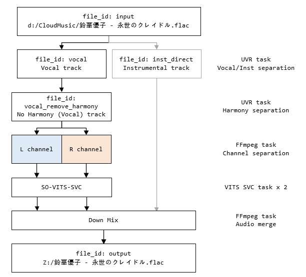
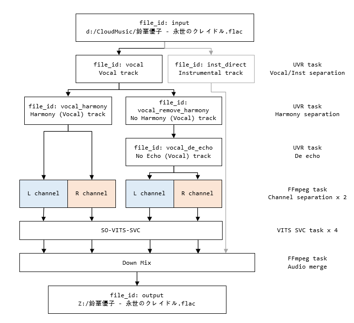
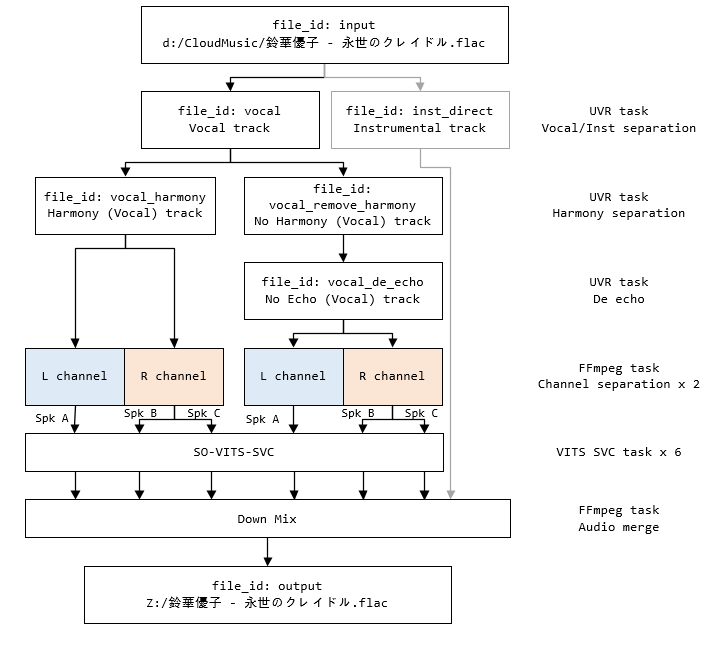

# so-vits-svc-pipeline

A python CLI pipeline script for running UVR tasks, So-VITS-SVC model inference and ffmpeg merge with end-to-end automation.

## 1. Prerequisite

Before running pipeline script, the following software must be installed first:

1. [UltimateVocalRemoverGUI] v5.6.0
2. [FFMpeg]
3. Latest version of [So-VITS-SVC 4.1] (Chinese document)

### 1.1 UVR GUI

Follow the **Manual Windows Installation** instruction in [UltimateVocalRemoverGUI]. If anaconda is used, try the following command:
```cmd
conda create -n uvr python=3.9
conda activate uvr
pip install -r requirements.txt
```

After installation, run UVR GUI and download required models (optional) via: `python UVR.py`

**Note**: The root path of UVR GUI is denoted as `uvr_path`.

### 1.2 FFMpeg

1. Download and extract [FFMpeg] (both ffmpeg and ffprobe are required)
2. Two choices:
   - Add the executable files into `PATH` environment, this script will detect them automatically. Check this step by opening a terminal (`cmd`) and type `ffmpeg -version`
   - Specify the path of `ffmpeg` and `ffprobe` in the `ffmpeg` section of the config json manually, or pass by argument `--ffmpeg.ffmpeg_path <ffmpeg_executable> --ffmpeg.ffprobe_path <ffprobe_executable>`


### 1.3 So-VITS-SVC 4.1

Here uses a community-maintain variation of [So-VITS-SVC 4.1] for simplifying preprocessing and training. Download and extract all files, the root path of So-VITS-SVC is denoted as `vits_path` later.

## 2. How to use

This repository contains two main modules to run the pipeline: **UVR-http-service** and **pipeline-client**. Each of them is deployed to different directory.

### 2.1 UVR-http-service

Put `uvr_api.py` and `uvr_api_server.py` into `uvr_path` (the root directory where UVR GUI is extracted). Then run `python uvr_api_server.py` instead of the previous command `python UVR.py`.

This time, UVR GUI is able to accept tasks through HTTP protocol (listening on port 8090 by default) and perform the corresponding automation steps (setting up parameters, inputs and outputs).

### 2.2 pipeline-client

To run So-VITS-SVC pipeline, ensure `run_svc_new.py` and `uvr_api_client.py` are in the same directory first, then run `python run_svc_new.py [-c vits_config.json] [-p default] [-k]` to perform end-to-end automation.

Arguments for this pipeline:
- `-c` or `--config`: config file for SO-VITS-SVC pipeline, default: `vits_config.json`
- `-p` or `--profile`: SO-VITS-SVC inference arguments (defined in the `vits` section of the config file), default: `default`
- `-k` or `--keep`: keep intermediate files during this pipeline (these files will be cleaned up after finish)

Other arguments will be set into config json, for example: `--file.input <input_file> --file.output <output_file_or_dir>` will overwrite the input file and output file in the config json

There are 3 preset config files provided in this repository, the corresponding process pipeline are also attached:

1. `vits_config.json` (default)
   - just separate vocal-instrumental tracks and remove harmony for the vocal track
   - relatively fast and can provide acceptable quality
   - 
2. `vits_config_with_harmony.json`
   - reserve harmony track and run VITS separately for the harmony track
   - slower and the F0 prediction for harmony track may fail quite often
   - can produce better quality for the songs with simple harmony
   - 
3. `vits_config_multi_spk.json` (experimental)
   - for multi-speaker VITS models only
   - 1 speaker per channel is recommended (one for L channel and another for R channel)
   - 


[UltimateVocalRemoverGUI]: https://github.com/Anjok07/ultimatevocalremovergui#manual-windows-installation
[So-VITS-SVC 4.1]: https://www.yuque.com/umoubuton/ueupp5/sdahi7m5m6r0ur1r
[FFMpeg]: https://ffmpeg.org/download.html
